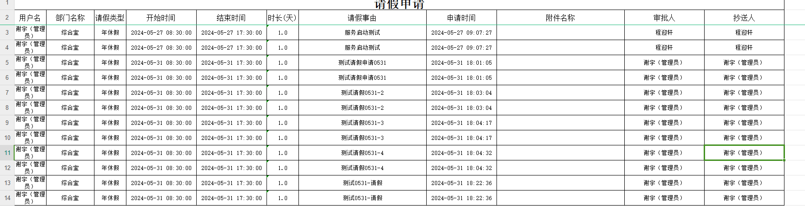

## 2024年

### 5月

#### 2024年5月31日

- [x] 1、办公流程粤政易消息模版整改（禅道5969）
- [x] 2、办公管理之荣誉奖项需求调整（禅道5970）
- [x] 3、管理制度增加文件名称查重功能（禅道5971）
- [x] 4、《数据提取备案申请》数据详情字段信息问题修复（禅道6011）
- [ ] 5、OA流程我的已办新增《台账导出》功能（禅道5972）-->自己发给自己，会导出（待办+已办+抄送）
- [x] 6、待办箱和抄送箱信息完善【区分已阅和未阅】（禅道5883）
- [x] 7、数据提取备案数据内容表单项输入方式变更为文本域类型
- [ ] 8、数据质检报告，错误明细excel与gdb增加时间戳。
- [ ] 9、图层数据更新功能（数据中台）

<!--more-->

##### **办公流程粤政易消息模版整改**

###### 配置文件修改

需要再apollo放开端口，否没有权限401

```
# geo-zhglpt-springboot-1.0.0.jar的application.properties
# 配置文件添加配置（测试环境ip172.16.2.68，生产ip172.16.2.75）
# 综管平台用戶接口
userSystem.getOauthidUrl = http://172.16.2.75:9000/user/user-system/secUser/selectOauthidByUserId
# 粤政易模版接口
newPortal.templateUrl =http://172.16.2.75:9000/findApp/commonApply/getMsgTemplate
```

###### sql

```
ALTER TABLE sjzx.bgzx_business_apply_info ADD biz_id varchar(36) NULL COMMENT '业务id'; 
ALTER TABLE sjzx.bgzx_business_apply_info CHANGE biz_id biz_id varchar(36) NULL COMMENT '业务id' AFTER process_instance_title; UPDATE sjzx.bgzx_business_apply_info SET biz_id = JSON_UNQUOTE(JSON_EXTRACT(process_business_json, '$.formId'));
```

###### 后端包

```
\\172.16.2.52\00\综管平台更新\202405281405\new-portal-1.0.jar
\\172.16.2.52\00\综管平台更新\202405281405\geo-zhglpt-springboot-1.0.0.jar
```

##### **办公管理之荣誉奖项需求调整**

###### 字典调整

```
荣誉奖项类型
```

##### 管理制度增加文件名称查重功能

##### 《数据提取备案申请》数据详情字段信息问题修复

###### sql

```
ALTER TABLE `zgpt_data_content` 
ADD COLUMN `number` int(8) NULL COMMENT '份数' AFTER `unit`;
```


##### OA流程我的已办新增《台账导出》功能

##### [我的待办/我的已办]添加未读标记

###### sql

```
ALTER TABLE process_instance_info ADD COLUMN read_flag char(1) DEFAULT 'N';

ALTER TABLE process_instance_info 
MODIFY COLUMN `read_flag` char(1) CHARACTER SET utf8 COLLATE utf8_general_ci NULL DEFAULT 'N' COMMENT '是否已读（N-否，Y-是）' AFTER `handle_status`;
```


###### 数据处理

```
处理之前的数据为已阅

select * from process_instance_info where  read_flag='N'
update process_instance_info set read_flag='Y' where read_flag='N'
```

###### 问题




##### 数据提取备案数据内容表单项输入方式变更为文本域类型


##### 图层数据更新功能（数据中台）


```
# 数据版本更新定时任务配置
geo.scheduled.enable = true
geo.scheduled。fixedDelay = 5000
```


菜单、字典配置

```

```


```
/*
 Navicat Premium Data Transfer

 Source Server         : 192.168.101.160
 Source Server Type    : PostgreSQL
 Source Server Version : 120001
 Source Host           : 192.168.101.160:54321
 Source Catalog        : zhglpt
 Source Schema         : public

 Target Server Type    : PostgreSQL
 Target Server Version : 120001
 File Encoding         : 65001

 Date: 28/05/2024 17:28:17
*/


-- ----------------------------
-- Table structure for data_update_layer
-- ----------------------------
DROP TABLE IF EXISTS "public"."data_update_layer";
CREATE TABLE "public"."data_update_layer" (
  "id" varchar(50) COLLATE "pg_catalog"."default" NOT NULL,
  "project_id" varchar(50) COLLATE "pg_catalog"."default" NOT NULL,
  "name" varchar(50) COLLATE "pg_catalog"."default" NOT NULL,
  "alias" varchar(50) COLLATE "pg_catalog"."default",
  "geometry_type" varchar(50) COLLATE "pg_catalog"."default" NOT NULL,
  "type" int4 NOT NULL,
  "adjust_layer_filter" varchar(255) COLLATE "pg_catalog"."default",
  "adjust_field_map" varchar(255) COLLATE "pg_catalog"."default",
  "sort" int4 NOT NULL,
  "create_time" "sys"."date" NOT NULL,
  "update_time" "sys"."date" NOT NULL
)
;
COMMENT ON COLUMN "public"."data_update_layer"."id" IS '图层ID';
COMMENT ON COLUMN "public"."data_update_layer"."project_id" IS '数据更新方案ID';
COMMENT ON COLUMN "public"."data_update_layer"."name" IS '图层名称';
COMMENT ON COLUMN "public"."data_update_layer"."alias" IS '图层别名';
COMMENT ON COLUMN "public"."data_update_layer"."geometry_type" IS '图形类型';
COMMENT ON COLUMN "public"."data_update_layer"."type" IS '图层类型，值可为：1（更新图层）、2（调整图层）、3（更新过程图层）';
COMMENT ON COLUMN "public"."data_update_layer"."adjust_layer_filter" IS '调整图层要素筛选条件，此字段值在type为2时有效';
COMMENT ON COLUMN "public"."data_update_layer"."adjust_field_map" IS '调整图层查询字段与更新图层字段匹配配置';
COMMENT ON COLUMN "public"."data_update_layer"."sort" IS '显示顺序';
COMMENT ON COLUMN "public"."data_update_layer"."create_time" IS '记录创建时间';
COMMENT ON COLUMN "public"."data_update_layer"."update_time" IS '记录更新时间';
COMMENT ON TABLE "public"."data_update_layer" IS '数据图层信息表';

-- ----------------------------
-- Table structure for data_update_layer_field
-- ----------------------------
DROP TABLE IF EXISTS "public"."data_update_layer_field";
CREATE TABLE "public"."data_update_layer_field" (
  "id" varchar(50) COLLATE "pg_catalog"."default" NOT NULL,
  "layer_id" varchar(50) COLLATE "pg_catalog"."default" NOT NULL,
  "name" varchar(255) COLLATE "pg_catalog"."default" NOT NULL,
  "alias" varchar(255) COLLATE "pg_catalog"."default",
  "type" varchar(50) COLLATE "pg_catalog"."default" NOT NULL,
  "length" varchar(50) COLLATE "pg_catalog"."default",
  "nullable" bool NOT NULL,
  "pk" bool NOT NULL,
  "sort" int4 NOT NULL,
  "create_time" "sys"."date" NOT NULL,
  "update_time" "sys"."date" NOT NULL
)
;
COMMENT ON COLUMN "public"."data_update_layer_field"."id" IS '字段ID';
COMMENT ON COLUMN "public"."data_update_layer_field"."layer_id" IS '图层ID';
COMMENT ON COLUMN "public"."data_update_layer_field"."name" IS '字段名称';
COMMENT ON COLUMN "public"."data_update_layer_field"."alias" IS '字段别名';
COMMENT ON COLUMN "public"."data_update_layer_field"."type" IS '字段类型，值包括：String、SmallInteger、Integer、Single、Double、Date、Blob';
COMMENT ON COLUMN "public"."data_update_layer_field"."length" IS '字段长度';
COMMENT ON COLUMN "public"."data_update_layer_field"."nullable" IS '是否可为空值';
COMMENT ON COLUMN "public"."data_update_layer_field"."pk" IS '是否为主键';
COMMENT ON COLUMN "public"."data_update_layer_field"."sort" IS '显示顺序';
COMMENT ON COLUMN "public"."data_update_layer_field"."create_time" IS '记录创建时间';
COMMENT ON COLUMN "public"."data_update_layer_field"."update_time" IS '记录更新时间';
COMMENT ON TABLE "public"."data_update_layer_field" IS '图层字段信息表';

-- ----------------------------
-- Table structure for data_update_project
-- ----------------------------
DROP TABLE IF EXISTS "public"."data_update_project";
CREATE TABLE "public"."data_update_project" (
  "id" varchar(50) COLLATE "pg_catalog"."default" NOT NULL,
  "name" varchar(255) COLLATE "pg_catalog"."default" NOT NULL,
  "lastest_data_source_id" varchar(50) COLLATE "pg_catalog"."default" NOT NULL,
  "process_data_source_id" varchar(50) COLLATE "pg_catalog"."default" NOT NULL,
  "history_data_source_id" varchar(50) COLLATE "pg_catalog"."default" NOT NULL,
  "layer_store_type" int4 NOT NULL,
  "push_type" int4 NOT NULL,
  "push_data_source_id" varchar(50) COLLATE "pg_catalog"."default",
  "push_layer_name" varchar(255) COLLATE "pg_catalog"."default",
  "deleted" bool NOT NULL DEFAULT false,
  "create_time" "sys"."date" NOT NULL,
  "update_time" "sys"."date" NOT NULL
)
;
COMMENT ON COLUMN "public"."data_update_project"."id" IS '数据更新方案ID';
COMMENT ON COLUMN "public"."data_update_project"."name" IS '数据更新方案名称';
COMMENT ON COLUMN "public"."data_update_project"."lastest_data_source_id" IS '最新库数据源Id';
COMMENT ON COLUMN "public"."data_update_project"."process_data_source_id" IS '更新过程库数据源Id';
COMMENT ON COLUMN "public"."data_update_project"."history_data_source_id" IS '历史库数据源Id';
COMMENT ON COLUMN "public"."data_update_project"."layer_store_type" IS '图层存放方式，值可为：1（分区县存放与省级汇总）、2（单图层）';
COMMENT ON COLUMN "public"."data_update_project"."push_type" IS '数据推送方式，值可为：1（无）、2（更新后立即推送）、3（手动推送）';
COMMENT ON COLUMN "public"."data_update_project"."push_data_source_id" IS '推送目标图层所在数据源Id';
COMMENT ON COLUMN "public"."data_update_project"."push_layer_name" IS '推送目标图层名称';
COMMENT ON COLUMN "public"."data_update_project"."deleted" IS '是否已删除，默认为false';
COMMENT ON COLUMN "public"."data_update_project"."create_time" IS '记录创建时间';
COMMENT ON COLUMN "public"."data_update_project"."update_time" IS '记录更新时间';
COMMENT ON TABLE "public"."data_update_project" IS '数据更新方案表';

-- ----------------------------
-- Table structure for data_update_task
-- ----------------------------
DROP TABLE IF EXISTS "public"."data_update_task";
CREATE TABLE "public"."data_update_task" (
  "id" varchar(50) COLLATE "pg_catalog"."default" NOT NULL,
  "name" varchar(50) COLLATE "pg_catalog"."default",
  "project_id" varchar(50) COLLATE "pg_catalog"."default" NOT NULL,
  "version_id" varchar(50) COLLATE "pg_catalog"."default" NOT NULL,
  "type" int4 NOT NULL,
  "status" int4 NOT NULL,
  "jszx_taskid" varchar(50) COLLATE "pg_catalog"."default",
  "weight" int4,
  "create_time" "sys"."date" NOT NULL,
  "update_time" "sys"."date" NOT NULL
)
;
COMMENT ON COLUMN "public"."data_update_task"."id" IS '任务ID';
COMMENT ON COLUMN "public"."data_update_task"."name" IS '任务名称';
COMMENT ON COLUMN "public"."data_update_task"."project_id" IS '数据更新方案Id';
COMMENT ON COLUMN "public"."data_update_task"."version_id" IS '版本号';
COMMENT ON COLUMN "public"."data_update_task"."type" IS '任务类型，值可为：11（更新）、12（更新回滚）、13（更新回退）、14（更新回退回滚）、21（推送）、22（推送回滚）、23（推送回退）、24（推送回退回滚）';
COMMENT ON COLUMN "public"."data_update_task"."status" IS '任务状态，值可为：1（排队中）、2（执行中）、3（执行成功）、4（执行失败）';
COMMENT ON COLUMN "public"."data_update_task"."jszx_taskid" IS '计算中心任务Id';
COMMENT ON COLUMN "public"."data_update_task"."weight" IS '任务执行权重，用于控制排队任务执行优先级，值越大越优先执行。回滚类型的任务优先级最高';
COMMENT ON COLUMN "public"."data_update_task"."create_time" IS '记录创建时间';
COMMENT ON COLUMN "public"."data_update_task"."update_time" IS '记录创建时间';
COMMENT ON TABLE "public"."data_update_task" IS '数据更新任务表';

-- ----------------------------
-- Table structure for data_update_version_status_log
-- ----------------------------
DROP TABLE IF EXISTS "public"."data_update_version_status_log";
CREATE TABLE "public"."data_update_version_status_log" (
  "id" varchar(50) COLLATE "pg_catalog"."default" NOT NULL,
  "version_id" varchar(50) COLLATE "pg_catalog"."default" NOT NULL,
  "status_type" int4 NOT NULL,
  "status" int4 NOT NULL,
  "remark" varchar(1000) COLLATE "pg_catalog"."default",
  "create_time" "sys"."date" NOT NULL
)
;
COMMENT ON COLUMN "public"."data_update_version_status_log"."id" IS '日志ID';
COMMENT ON COLUMN "public"."data_update_version_status_log"."version_id" IS '版本号';
COMMENT ON COLUMN "public"."data_update_version_status_log"."status_type" IS '版本类型，1为更新状态，2为推送状态';
COMMENT ON COLUMN "public"."data_update_version_status_log"."status" IS '具体状态，根据status_type不同，对应更新状态或者推送状态具体值';
COMMENT ON COLUMN "public"."data_update_version_status_log"."remark" IS '状态变化说明';
COMMENT ON COLUMN "public"."data_update_version_status_log"."create_time" IS '记录创建时间';
COMMENT ON TABLE "public"."data_update_version_status_log" IS '数据版本状态变化日志表';

-- ----------------------------
-- Indexes structure for table data_update_layer
-- ----------------------------
CREATE INDEX "layer_project_id_idx" ON "public"."data_update_layer" USING btree (
  "project_id" COLLATE "pg_catalog"."default" "pg_catalog"."text_ops" ASC NULLS LAST
);

-- ----------------------------
-- Primary Key structure for table data_update_layer
-- ----------------------------
ALTER TABLE "public"."data_update_layer" ADD CONSTRAINT "data_update_layer_pkey" PRIMARY KEY ("id");

-- ----------------------------
-- Indexes structure for table data_update_layer_field
-- ----------------------------
CREATE INDEX "layer_field_layer_id_idx" ON "public"."data_update_layer_field" USING btree (
  "layer_id" COLLATE "pg_catalog"."default" "pg_catalog"."text_ops" ASC NULLS LAST
);

-- ----------------------------
-- Primary Key structure for table data_update_layer_field
-- ----------------------------
ALTER TABLE "public"."data_update_layer_field" ADD CONSTRAINT "data_update_layer_field_pkey" PRIMARY KEY ("id");

-- ----------------------------
-- Primary Key structure for table data_update_project
-- ----------------------------
ALTER TABLE "public"."data_update_project" ADD CONSTRAINT "data_update_project_pkey" PRIMARY KEY ("id");

-- ----------------------------
-- Indexes structure for table data_update_task
-- ----------------------------
CREATE INDEX "task_project_id_idx" ON "public"."data_update_task" USING btree (
  "project_id" COLLATE "pg_catalog"."default" "pg_catalog"."text_ops" ASC NULLS LAST
);
CREATE INDEX "task_version_id_idx" ON "public"."data_update_task" USING btree (
  "version_id" COLLATE "pg_catalog"."default" "pg_catalog"."text_ops" ASC NULLS LAST
);

-- ----------------------------
-- Primary Key structure for table data_update_task
-- ----------------------------
ALTER TABLE "public"."data_update_task" ADD CONSTRAINT "data_update_task_pkey" PRIMARY KEY ("id");

-- ----------------------------
-- Indexes structure for table data_update_version_status_log
-- ----------------------------
CREATE INDEX "version_status_log_version_id" ON "public"."data_update_version_status_log" USING btree (
  "version_id" COLLATE "pg_catalog"."default" "pg_catalog"."text_ops" ASC NULLS LAST
);

-- ----------------------------
-- Primary Key structure for table data_update_version_status_log
-- ----------------------------
ALTER TABLE "public"."data_update_version_status_log" ADD CONSTRAINT "data_update_version_status_log_pkey" PRIMARY KEY ("id");


ALTER TABLE "public"."process_instance_info" ADD COLUMN "read_flag" char(1) DEFAULT 'N';

COMMENT ON COLUMN "public"."process_instance_info"."read_flag" IS '是否已读（N-否，Y-是）';
```

